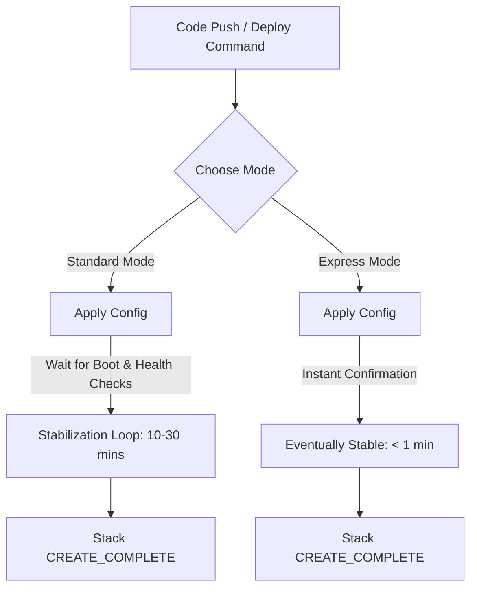

# Say Goodbye to Stabilization Waits: How AWS CloudFormation Express Mode Accelerates Your IaC Pipelines

Every cloud engineer knows the pain of the "infrastructure wait loop." 

You modify a single security group rule or rename a parameter in your YAML file, trigger your deployment pipeline, and then... you wait. Ten minutes pass while AWS CloudFormation checks, validates, and waits for every resource to reach a fully stabilized state before marking your stack as `CREATE_COMPLETE`.

During production releases, this safety rail is essential. But during local testing, developer experimentation, or fast-moving automated pipelines? It's a massive productivity killer.

On **June 30, 2026**, AWS resolved this bottleneck by introducing **AWS CloudFormation Express Mode**—a new deployment option designed to accelerate infrastructure rollouts by up to **4x**.

Let's do a quick deep-dive sharing session on how this new mode works, where you should use it, and why it changes the developer experience.

---

## The Bottleneck: Standard Mode Stabilization

By default, CloudFormation operates in **Standard Mode**. When you deploy a stack, CloudFormation doesn't just create the resource configuration; it monitors the physical resource until it is fully ready to serve traffic. 

For instance:
*   An **Amazon RDS database** must fully provision, allocate storage, and pass health checks.
*   An **Application Load Balancer (ALB)** must propagate its DNS settings.
*   **Amazon ECS tasks** must launch, fetch container images, and register with target groups.

Only after these stabilization checks pass does CloudFormation report success. If a single resource fails to stabilize, the entire stack rolls back. This process is secure, but it can take 15 to 30 minutes.

---

## Enter Express Mode: Fast-Feedback Infrastructure

**CloudFormation Express Mode** changes the definition of a "completed" deployment. 

Instead of waiting for resource health checks and boot sequences, Express Mode marks a resource as complete **as soon as the AWS service accepts the creation API call and applies the configuration**.

Here is how the workflow shifts:

### Key Capabilities:
1.  **Up to 4x Faster Deployments:** Cuts stack provisioning wait times from several minutes down to seconds, providing sub-minute feedback loops.
2.  **Transient Failure Resilience:** If dependent resources fail to provision due to minor, temporary backend hiccups, CloudFormation Express automatically retries them in the background rather than triggering a full rollback immediately.
3.  **Eventually Stable Model:** The stack reports deployment success immediately, while the physical resources stabilize in the background.

---

## Ideal Use Cases: When to Use Express Mode

Express Mode is not a wholesale replacement for Standard Mode. It is a specialized tool tailored for:
*   **Iterative Local Development:** Quickly testing infrastructure changes in developer sandbox accounts.
*   **Automated Testing Pipelines:** Spinning up test stacks, executing smoke tests, and destroying them without waiting for prolonged stabilization times.
*   **AI-Assisted IaC Development:** As LLMs and AI coding agents are increasingly tasked with writing and deploying CloudFormation templates, they require ultra-fast feedback loops to correct configuration errors. Express Mode provides that instant feedback.

> [!WARNING]
> **Avoid Express Mode in Production:** Because Express Mode does not wait for traffic health checks, your deployment will report success even if a service fails to boot up correctly due to a configuration bug. Keep production stacks on **Standard Mode** to ensure traffic is never routed to unhealthy resources.

---

## Senior Engineering Insights: Why This Matters

This release reflects a broader trend in cloud engineering: **optimizing Developer Experience (DevEx)**. Historically, local cloud development has been slow and painful because of the latency between writing code and seeing it run. Express Mode bridges this gap by decoupling the deployment control plane from data plane stabilization.

*Have you enabled Express Mode in your development sandboxes yet? Have you noticed the speed improvement in your CI/CD pipelines? Let's discuss in the comments below!*

---
#AWS #CloudFormation #IaC #DevOps #DevEx #CloudEngineering #Automation

*Original AWS Blog Post:* [AWS CloudFormation launches Express Mode for faster deployments](https://aws.amazon.com/blogs/aws/) (Published June 30, 2026)
