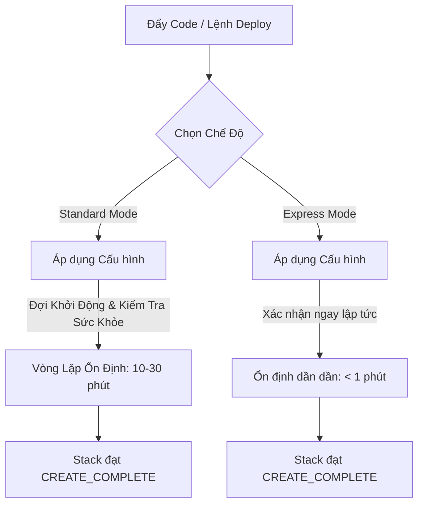

# Tạm Biệt Chờ Đợi Ổn Định: Cách AWS CloudFormation Express Mode Tăng Tốc Kênh Deploy IaC

Mọi kỹ sư đám mây đều hiểu rõ nỗi đau của "vòng lặp chờ đợi hạ tầng."

Bạn chỉ sửa đổi một rule security group hoặc đổi tên một tham số trong file YAML, bấm chạy pipeline deploy, và rồi... bạn ngồi chờ. Mười phút trôi qua trong khi AWS CloudFormation kiểm tra, xác thực và chờ đợi từng tài nguyên đạt trạng thái ổn định hoàn toàn trước khi đánh dấu stack của bạn là `CREATE_COMPLETE`.

Khi deploy trên môi trường production, rào chắn an toàn này là vô cùng cần thiết. Thế nhưng khi bạn đang test local, thử nghiệm tính năng mới, hoặc chạy các pipeline tự động cần phản hồi nhanh? Đó là một kẻ hủy diệt hiệu suất làm việc thực sự.

Vào ngày **30 tháng 6 năm 2026**, AWS đã giải quyết điểm nghẽn này bằng cách ra mắt **AWS CloudFormation Express Mode**—một chế độ deploy mới giúp tăng tốc độ triển khai hạ tầng lên đến **4 lần**.

Dưới đây là một bài chia sẻ ngắn về cách hoạt động của chế độ mới này, khi nào bạn nên dùng nó, và tại sao nó lại thay đổi trải nghiệm của lập trình viên.

---

## Điểm Nghẽn: Quá Trình Ổn Định Ở Chế Độ Standard Mode

Mặc định, CloudFormation hoạt động ở chế độ **Standard Mode**. Khi bạn deploy một stack, CloudFormation không chỉ tạo cấu hình tài nguyên; nó còn giám sát tài nguyên vật lý đó cho đến khi nó hoàn toàn sẵn sàng nhận traffic.

Ví dụ:
*   Một **cơ sở dữ liệu Amazon RDS** phải hoàn tất quá trình khởi tạo vật lý, cấp phát lưu trữ và vượt qua các bài kiểm tra sức khỏe (health checks).
*   Một **Application Load Balancer (ALB)** phải mất thời gian propagate cấu hình DNS.
*   Các **EKS/ECS task** phải khởi chạy, kéo container image về và đăng ký thành công với target groups.

Chỉ khi tất cả các bước kiểm tra ổn định này thành công, CloudFormation mới báo trạng thái hoàn tất. Nếu một tài nguyên đơn lẻ gặp lỗi trong lúc khởi động, toàn bộ stack sẽ bị rollback. Quy trình này cực kỳ an toàn, nhưng có thể tiêu tốn từ 15 đến 30 phút chờ đợi.

---

## Express Mode: Phản Hồi Hạ Tầng Siêu Tốc

**CloudFormation Express Mode** định nghĩa lại thời điểm một deployment được coi là "hoàn thành".

Thay vì bắt kỹ sư phải đợi tài nguyên khởi động và kiểm tra sức khỏe xong xuôi, Express Mode sẽ đánh dấu tài nguyên đó là hoàn tất **ngay khi dịch vụ AWS chấp nhận lệnh gọi API khởi tạo và áp dụng cấu hình thành công**.

Dưới đây là cách quy trình thay đổi:

### Các tính năng cốt lõi:
1.  **Deploy nhanh hơn tới 4 lần:** Giảm thời gian chờ đợi triển khai stack từ nhiều phút xuống chỉ còn vài giây, mang lại vòng lặp phản hồi dưới 1 phút.
2.  **Khả năng tự phục hồi lỗi tạm thời:** Nếu các tài nguyên phụ thuộc gặp lỗi khởi tạo do sự cố mạng tạm thời phía backend, CloudFormation Express sẽ tự động thử lại (retry) ngầm thay vì kích hoạt rollback toàn bộ stack ngay lập tức.
3.  **Mô hình ổn định dần dần (Eventually Stable):** Stack sẽ báo cáo deploy thành công ngay lập tức, trong khi các tài nguyên vật lý sẽ tiếp tục tự ổn định ngầm ở backend.

---

## Trường Hợp Sử Dụng Lý Tưởng: Khi Nào Nên Dùng Express Mode?

Express Mode không sinh ra để thay thế hoàn toàn Standard Mode. Nó là một công cụ chuyên biệt tối ưu cho:
*   **Phát triển và kiểm thử nội bộ (Local Dev):** Giúp kiểm tra nhanh các thay đổi hạ tầng trong tài khoản sandbox cá nhân.
*   **Pipeline kiểm thử tự động (CI/CD Sandbox):** Khởi tạo nhanh các stack thử nghiệm, chạy smoke test và hủy (destroy) chúng ngay lập tức mà không tốn thời gian chờ đợi.
*   **Phát triển IaC hỗ trợ bởi AI:** Khi các mô hình LLM và AI Agent ngày càng được giao nhiều việc viết và triển khai template CloudFormation, chúng cần các vòng lặp phản hồi cực nhanh để sửa lỗi cú pháp/cấu hình. Express Mode cung cấp phản hồi tức thì đó.

> [!WARNING]
> **Tránh sử dụng Express Mode trên Production:** Vì Express Mode không đợi kiểm tra sức khỏe của tài nguyên, stack của bạn sẽ báo thành công ngay cả khi dịch vụ bên dưới bị lỗi khởi động do bug cấu hình phần mềm. Hãy giữ môi trường Production ở chế độ **Standard Mode** để đảm bảo traffic không bao giờ bị dẫn vào các tài nguyên không khỏe mạnh.

---

## Góc Nhìn Của Kỹ Sư Senior: Tại Sao Tính Năng Này Quan Trọng?

Sự ra mắt này phản ánh một xu hướng lớn trong ngành kỹ nghệ đám mây: **Tối ưu hóa trải nghiệm của lập trình viên (Developer Experience - DevEx)**. Từ trước đến nay, việc phát triển cloud cục bộ luôn bị coi là chậm chạp do độ trễ khi áp dụng hạ tầng thực tế. Express Mode thu hẹp khoảng cách này bằng cách tách biệt tầng điều khiển (deployment control plane) khỏi tầng ổn định dữ liệu thực tế.

*Bạn đã bật thử Express Mode trong tài khoản sandbox của mình chưa? Bạn có thấy pipeline CI/CD của mình chạy nhanh hơn rõ rệt không? Hãy chia sẻ trải nghiệm ở phần bình luận bên dưới nhé!*

---
#AWS #CloudFormation #IaC #DevOps #DevEx #CloudEngineering #Automation

*Bài viết gốc trên AWS Blog:* [AWS CloudFormation launches Express Mode for faster deployments](https://aws.amazon.com/blogs/aws/) (Xuất bản ngày 30/06/2026)
